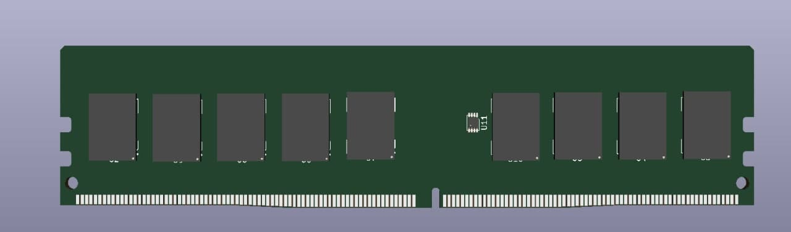

# Memoria RAM / RAM Memory
In this GitHub's repository will be placed the design of a Ram Memories

- [SODIMM](/SODIMM)

The SODIMM memories are the laptop memories

- [UDIMM](/UDIMM)

The UDIMM memories are the PC memories

Templates: 
https://github.com/DRubioG/KiCad_Templates